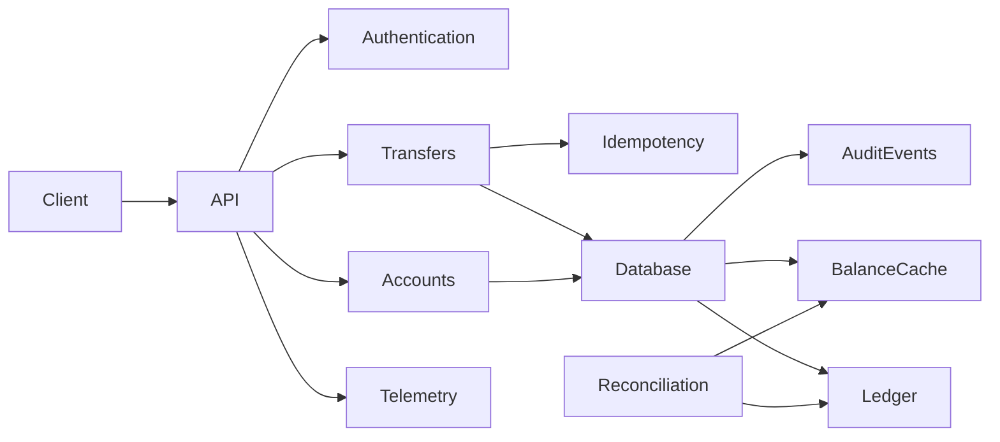
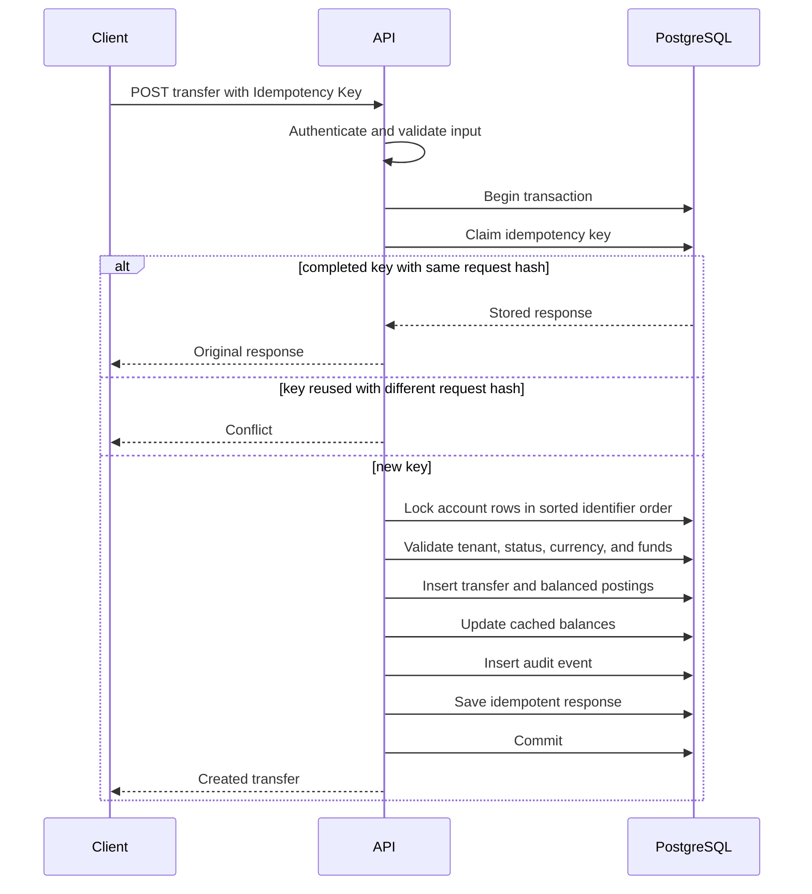

# SuperCool Finances ledger service architecture specification

Status: proposed for implementation approval

## 1. Purpose

Build a public, production shaped account balance service that proves five claims.

1. Every balance change has corresponding balanced ledger postings.
2. Concurrent requests cannot spend the same funds.
3. Repeated requests cannot move money twice.
4. Partial failures cannot leave partial financial state.
5. Operators can trace, diagnose, and reconcile every operation without exposing sensitive data.

The submission will include the service, automated tests, local environment, hosted Render environment, infrastructure definition, OpenAPI contract, architecture documentation, complete visible AI transcript, and a narrated Remotion video.

## 2. Scope

The service supports one tenant owning accounts in one of the configured currencies. A transfer can move funds only between accounts with the same currency.

The implemented operations are:

1. Create an account with a zero balance.
2. Read an account and its current balance.
3. List immutable ledger entries with cursor pagination.
4. Create an internal transfer.
5. Read a transfer.
6. Seed demonstration funds through a development command that posts against a system treasury account.
7. Reconcile cached balances against ledger postings.
8. Report health, metrics, errors, traces, and audit events.

The service does not implement foreign exchange, external bank settlement, cards, holds, interest, account deletion, distributed transactions, or a customer interface. Those omissions are deliberate.

## 3. Technology decisions

The service uses TypeScript on a pinned Bun runtime. Fastify handles HTTP routing, lifecycle hooks, structured logging, and JSON Schema request and response validation. PostgreSQL owns durable state and concurrency control.

The critical transfer path uses explicit SQL. A small typed database adapter handles connection pooling and transaction boundaries. No ORM may hide row locks, constraint behavior, or transaction ordering.

The project uses:

1. TypeScript with strict compiler settings.
2. Bun for dependency management, scripts, tests, and runtime.
3. Fastify for the HTTP application.
4. TypeBox schemas for runtime validation and inferred TypeScript types.
5. PostgreSQL for all financial state.
6. SQL migration files with a small migration runner.
7. Pino structured logs through Fastify.
8. OpenTelemetry for request and database traces.
9. Prometheus compatible metrics.
10. Sentry as an optional error destination when `SENTRY_DSN` is configured.
11. Docker Compose for local PostgreSQL and application execution.
12. Render Blueprint infrastructure in `render.yaml`.
13. Remotion for the explanation video.
14. ElevenLabs for narration generated by a local build script.

## 4. Architecture

The system is one deployable microservice with internal modules. Network boundaries do not divide the ledger transaction.



The internal modules are:

1. `accounts`, which creates and reads accounts.
2. `ledger`, which defines journals, postings, and financial invariants.
3. `transfers`, which owns the only customer balance mutation path.
4. `idempotency`, which claims request keys and persists responses.
5. `auth`, which validates development JWTs and enforces tenant scopes.
6. `reconciliation`, which compares cached balances with ledger sums.
7. `observability`, which configures logs, metrics, traces, and error capture.
8. `platform`, which owns configuration, database connections, migrations, and shutdown.

## 5. Money representation

The API accepts money as a decimal string and an ISO currency code. The domain parser validates the number of fractional digits for the currency and converts the value to integer minor units.

The application uses JavaScript `bigint`. PostgreSQL uses `BIGINT`. JSON responses serialize minor units as strings, because normal JavaScript numbers cannot represent every `BIGINT` value exactly.

No financial calculation uses floating point arithmetic.

## 6. Data model

### Tenants

`tenants` contains `id`, `name`, `created_at`, and `status`.

### Accounts

`accounts` contains `id`, `tenant_id`, `name`, `currency`, `balance_minor`, `status`, `created_at`, and `updated_at`.

The database checks that `balance_minor` is never below zero. Every balance mutation locks the account row first.

### Journal transactions

`journal_transactions` contains `id`, `tenant_id`, `kind`, `reference`, `created_at`, and an optional `reverses_transaction_id`.

Posted journal transactions are immutable.

### Postings

`postings` contains `id`, `journal_transaction_id`, `account_id`, `currency`, `amount_minor`, and `created_at`.

Positive and negative signed minor units represent the direction of a posting. A deferred database constraint trigger verifies that all postings for one journal transaction use the same currency and sum to zero before commit.

Database triggers reject updates and deletion of journal transactions and postings.

### Transfers

`transfers` contains `id`, `tenant_id`, `source_account_id`, `destination_account_id`, `currency`, `amount_minor`, `journal_transaction_id`, `status`, `created_at`, and `completed_at`.

The first implementation persists only completed transfers. Failed requests return structured errors and do not create financial records.

### Idempotency records

`idempotency_records` contains `tenant_id`, `scope`, `key`, `request_hash`, `state`, `response_status`, `response_body`, `resource_id`, `created_at`, and `completed_at`.

A unique constraint covers `tenant_id`, `scope`, and `key`.

### Audit events

`audit_events` contains `id`, `tenant_id`, `actor_id`, `action`, `resource_type`, `resource_id`, `request_id`, `outcome`, `metadata`, and `created_at`.

Audit metadata excludes tokens, account numbers, balances, and request bodies.

## 7. Financial invariants

The implementation and tests enforce these statements.

1. Every journal transaction balances to zero in one currency.
2. Posted journal data is append only.
3. No endpoint can set an account balance directly.
4. A balance update and its ledger postings commit in one database transaction.
5. A successful idempotency key identifies at most one transfer.
6. A source balance cannot become negative.
7. Internal transfers conserve total money.
8. Every account, transfer, idempotency record, and audit event belongs to one tenant.
9. Reconciliation can derive each cached balance from immutable postings.

## 8. Transfer algorithm



The database transaction runs under `READ COMMITTED`. Explicit `SELECT FOR UPDATE` locks serialize mutations of the known account rows. The service locks rows in stable identifier order to reduce deadlocks.

If the process fails before commit, PostgreSQL rolls back every write. If the process commits but the response is lost, the client retries with the same key and receives the stored response.

## 9. API contract

The public endpoints are:

```text
POST /v1/accounts
GET  /v1/accounts/{accountId}
GET  /v1/accounts/{accountId}/entries
POST /v1/transfers
GET  /v1/transfers/{transferId}
GET  /health/live
GET  /health/ready
GET  /metrics
GET  /docs
GET  /openapi.json
```

`POST /v1/transfers` requires `Idempotency-Key` and returns:

1. `201` for the first successful request.
2. `200` with `Idempotent-Replayed: true` for a completed replay.
3. `409` when the same key is reused with a different payload.
4. `422` for insufficient funds or incompatible currency.
5. `401` for missing or invalid authentication.
6. `404` for resources outside the authenticated tenant.

Errors use the Problem Details JSON format. The OpenAPI document includes successful, replayed, validation, authorization, insufficient funds, and conflict examples.

## 10. Authentication and authorization

The assessment does not implement an identity provider. A development token command signs JWTs with a local secret. Tokens contain `sub`, `tenant_id`, `scope`, `iat`, and `exp` claims.

Every repository query receives the authenticated tenant identifier. Queries never retrieve a resource by public identifier alone. Cross tenant requests return the same not found response as unknown resources.

The hosted demonstration contains synthetic data only. The public documentation provides a restricted demonstration token or a command that obtains one from a safe demonstration endpoint. That mechanism cannot mint administrative credentials or change service behavior.

## 11. Observability

The service emits structured JSON logs to standard output. Every request receives a request identifier. Logs contain the request identifier, trace identifier, route, method, status, duration, transfer identifier when available, and a stable error code.

Logs never contain JWTs, authorization headers, idempotency keys, request bodies, account names, balances, or raw database connection strings. Automated tests inspect captured logs for redaction.

OpenTelemetry creates spans for HTTP requests, transfer orchestration, idempotency decisions, row locking, ledger insertion, reconciliation, and database calls. Local development can export traces to an OpenTelemetry collector. Render can export through a configured OTLP endpoint.

Prometheus compatible metrics include:

1. HTTP request count and duration by route, method, and status class.
2. Transfer attempts by outcome.
3. Idempotency replay and conflict counts.
4. Database transaction duration and retry counts.
5. Database pool usage and wait duration.
6. Reconciliation runs and discrepancy counts.
7. Authentication failures.
8. Unhandled error counts.

Metric labels never include account, transfer, tenant, idempotency, or request identifiers.

Sentry receives unexpected errors only when `SENTRY_DSN` is configured. Expected domain outcomes such as insufficient funds do not create Sentry issues. Sensitive fields pass through a final redaction hook before export.

The documentation defines alerts for sustained server errors, database pool exhaustion, elevated transaction latency, reconciliation discrepancies, repeated authentication failures, and an unhealthy readiness endpoint.

## 12. Reconciliation

`bun run reconcile` calculates the signed posting sum for every account and compares it with `accounts.balance_minor`.

A clean run exits with zero and reports the account count. A mismatch emits an error log, increments the discrepancy metric, records an audit event, and exits with a failure status. The command never repairs balances automatically.

Tests create a controlled discrepancy through a privileged test connection and confirm that reconciliation detects it.

## 13. Testing strategy

Tests use real PostgreSQL for every behavior that depends on transactions, constraints, or locks.

The required tests are:

1. Money parsing and serialization unit tests.
2. Request and response schema tests.
3. Balanced posting database constraint tests.
4. Ledger immutability tests.
5. Successful transfer integration tests.
6. Insufficient funds rollback tests.
7. Same key replay tests.
8. Same key with different payload conflict tests.
9. Concurrent duplicate request tests.
10. Concurrent overspend tests using separate database connections.
11. Stable account lock ordering tests.
12. Tenant isolation tests.
13. Process failure injection before commit.
14. Reconciliation success and discrepancy tests.
15. Log and error redaction tests.
16. Metrics increment tests.
17. OpenAPI contract validation.
18. Migration from an empty database.
19. Docker image smoke test.
20. Property tests that generate transfer sequences and verify conservation and nonnegative balances.

The repository maps every stated risk to its database mechanism and test file.

## 14. Local development and continuous integration

The primary commands are:

```text
bun install --frozen-lockfile
bun run db:up
bun run db:migrate
bun run dev
bun test
bun run demo
bun run reconcile
bun run check
```

`bun run check` runs formatting verification, linting, type checking, unit tests, integration tests, OpenAPI validation, migration tests, and the production build.

GitHub Actions starts PostgreSQL and runs the complete check. A second job builds the Docker image and executes its health smoke test. A third job validates `render.yaml`, scans committed files for secrets, and checks documentation links.

## 15. Render deployment

`render.yaml` defines one paid Docker web service and one paid Render PostgreSQL database. It connects them through a managed database URL, runs migrations before deployment, checks `/health/ready`, and pins the application region and runtime configuration.

Secrets remain in Render. The repository contains only `.env.example` with safe names and descriptions.

The hosted service exposes synthetic demonstration data. The README labels the deployment as an assessment environment. The production discussion explains high availability, point in time recovery, connection pooling, private networking, key rotation, and incident response without pretending that the demonstration configuration provides them.

## 16. Documentation and presentation

The README starts with the financial correctness promise, hosted links, local quickstart, invariants, two Mermaid diagrams, one demonstration command, and a risk to evidence map.

Supporting documents include:

1. Architecture and data model.
2. Threat model.
3. Operations and incident guide.
4. Observability guide.
5. Cloud deployment tradeoffs.
6. Three architecture decision records covering immutable ledger design, locked cached balances, and persistent idempotency.
7. OpenAPI document with examples.
8. Complete visible AI interaction transcript and manifest.
9. Review findings and resolution log for both verification rounds.

## 17. Remotion video

The Remotion video explains the design and then demonstrates the running service. It uses a restrained editorial visual language, readable typography, diagrams derived from the documentation, terminal captures generated by the real demo script, and captions derived from the narration script.

The storyboard is:

1. State the failure modes a balance service must prevent.
2. Introduce the immutable double entry ledger.
3. Animate the transfer transaction and deterministic account locks.
4. Explain idempotency after an uncertain network response.
5. Run the actual successful transfer and display its balanced postings.
6. Replay the same request and show that no second transfer appears.
7. Run competing transfers and show the safe rejection.
8. Display structured logs, traces, metrics, and reconciliation output.
9. Close with links to the repository, OpenAPI page, and hosted service.

The video generation pipeline is deterministic:

1. `bun run demo:capture` resets synthetic data and writes sanitized results to `video/assets/demo-run.json`.
2. `video/narration/script.json` contains the approved narration and scene identifiers.
3. `bun run video:voice` sends narration to ElevenLabs from a local server side script using `ELEVENLABS_API_KEY` and `ELEVENLABS_VOICE_ID`.
4. The script writes a versioned MP3 asset and generation metadata without secret values.
5. Remotion reads the narration, captions, diagrams, and captured demonstration output.
6. `bun run video:render` produces the final MP4.
7. An automated check confirms that every demonstrated transfer identifier and amount exists in the captured run.

The ElevenLabs key is restricted to text to speech access with a credit quota. It never enters Render, client code, Remotion props, logs, Git history, or the AI transcript.

## 18. AI disclosure

The repository records every visible project prompt and response, including subagent task prompts and returned reviews. Each record contains a sequence number, timestamp, participant, prompt, response, affected files, and any human correction.

Hidden platform instructions, secrets, raw tool authentication, and unrelated prior conversations are excluded. Tool commands appear when they materially changed or verified the project. Generated binary artifacts link back to their source prompt or script.

## 19. Repository structure

```text
supercool-ledger/
  .github/workflows/
  docs/
    adr/
    ai-usage/
    reviews/
    architecture.md
    observability.md
    operations.md
    threat-model.md
  infra/
    render.yaml
  migrations/
  scripts/
  src/
    accounts/
    auth/
    idempotency/
    ledger/
    observability/
    platform/
    reconciliation/
    transfers/
  test/
    integration/
    property/
    unit/
  video/
    assets/
    narration/
    src/
  Dockerfile
  docker-compose.yml
  openapi.json
  package.json
  README.md
  render.yaml
```

## 20. Public release process

The project will be created as a public GitHub repository. Work will occur on a conventional feature branch through a pull request assigned to `loama`. Commits will separate schema, domain logic, API, observability, tests, deployment, documentation, and video work.

Before each push, the complete diff receives secret scanning, whitespace validation, focused tests, and the relevant broader checks. The final pull request must have green required checks, no unresolved review findings, and a verified public Render deployment before merge.

## 21. Independent verification

Two full verification rounds occur after implementation.

Each round uses three independent reviewers:

1. A financial correctness and security reviewer checks invariants, SQL, locking, idempotency, authorization, and failure handling.
2. A software quality and operations reviewer checks architecture, API behavior, tests, migrations, observability, Docker, CI, and Render configuration.
3. A presentation reviewer checks the README, diagrams, OpenAPI examples, AI disclosure, hosted demo, narration, visual quality, captions, and agreement between the video and real outputs.

The primary agent acts as judge. It reproduces every plausible finding, rejects unsupported findings with evidence, applies confirmed changes, and reruns the complete verification gate.

The second round starts with fresh reviewer prompts and the corrected repository. It does not assume that the first round found every problem.

## 22. Acceptance criteria

The project is ready for Eduardo's final verification only when:

1. A public GitHub repository is accessible.
2. A clean checkout passes the documented setup and complete check.
3. All database invariants have direct tests.
4. Concurrent overspend and duplicate request tests use real PostgreSQL connections and pass repeatedly.
5. Reconciliation reports no discrepancy after the demonstration.
6. Logs and exported errors pass redaction tests.
7. The OpenAPI document matches the running API.
8. The Docker image passes its health smoke test.
9. Render hosts the service and paid PostgreSQL database successfully.
10. `render.yaml` matches the deployed resources.
11. The README links work from the public repository.
12. The Remotion video uses real captured demonstration data and ElevenLabs narration.
13. Captions match the narration.
14. The complete visible AI transcript is committed without secrets.
15. Both three reviewer verification rounds are documented and resolved.
16. The final judge reruns all local and hosted checks after the second round.

## 23. Required credentials and external access

Implementation and local verification do not require secrets. The final hosted and narrated deliverables require:

1. GitHub authentication with permission to create a public repository.
2. Render authentication with permission to create a paid web service and PostgreSQL database.
3. An ElevenLabs API key restricted to text to speech and a selected voice identifier.

If these credentials are unavailable in the environment, work continues through every local artifact and stops only at the relevant external authorization boundary.
